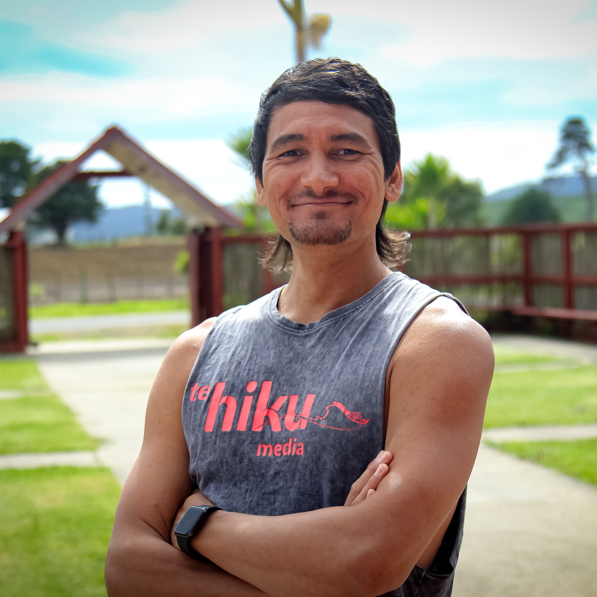

## ICML 2021 Wednesday July 21st 1pm-3pm PDT

Indigenous In AI's 2021 event will be a two hour event featuring Keoni and Peter Lucas discussing Data Sovereignty and their work on Maori Automatic Speech Recognition. 

More details coming!

### Speakers

|  | Keoni Mahelona |
| :---: | :--- |
| {:width="150px"} | Keoni (Kanaka Māoli) is the Chief Technology Officer at Te Hiku Media and a leading practitioner of indigenous data sovereignty. Originally from Anahola on the island of Kauaʻi, Hawaiʻi. Keoni has been living and working in Te Hiku o Te Ika for 10 years having first arrived in Aotearoa as a Fulbright Scholar. As a driving force behind the development of digital innovation projects that seek to secure the future of te reo Māori and other indigenous languages, Keoni makes decisions every day to protect the sovereignty of Māori data, from the digital tools employed to advance projects, the storage of data and sharing data in appropriate and secure ways.|
|| __He Hawaiʻi au mau au!__ _I am Hawaiian forever and ever!_ |
  
  
|  | Peter-Lucas K Jones |
| :---: | :--- |
| {:width="150px"} | Peter-Lucas (Te Aupōuri, Ngāi Takoto, Ngāti Kahu) is the Chief Executive Officer of Te Hiku Media and an experienced governor in the Māori media eco-system. He is currently the Chair of Te Whakaruruhau o ngā Reo Irirangi Māori, Deputy Chair of Māori Television and Deputy Chairman of Te Rūnanga Nui o Te Aupōuri, and board member of Te Pūnaha Matatini, a Centre of Research Excellence for Complex Systems. As a trusted kaitiaki of Māori data, Peter-Lucas negotiates the responsibility of protecting iwi and Māori data while meeting the needs of funders and the expectations of iwi and hapū. Peter-Lucas has terrestrial and digital experience working with kaumātua and marae to record and provide access to te reo ā-iwi, tikanga ā-iwi, kōrero tuku iho and iwi history. This experience has seen the development of a Kaitiakitanga License for Te Hiku Media that provides a framework to guide the use of Māori data from a haukāinga perspective. |