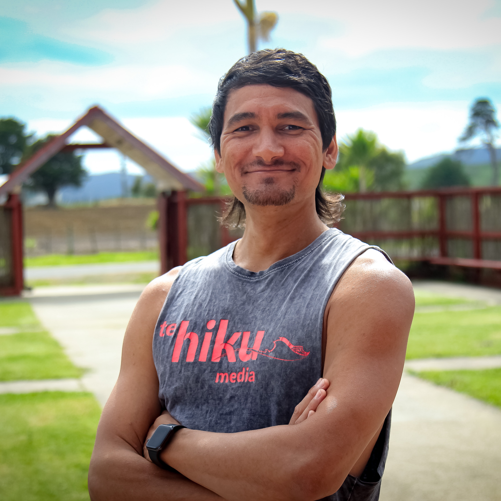
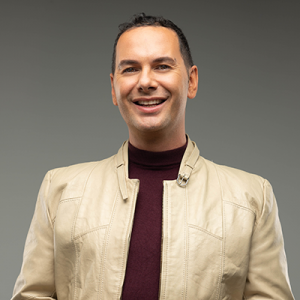
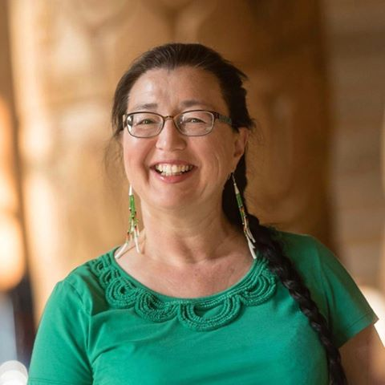
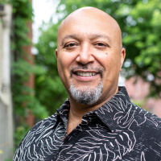

## Welcome!

Indigenous In AI’s vision is to build an international community of Native, Aboriginal, and First Nations who will collectively transform their home communities with advanced technology. By elevating the voices of Indigenous ML researchers we will inspire future impactful work and break stereotypes. Additionally, this group will strive to educate the broader NeurIPS on contemporary indigenous issues relevant to information technology and practices.

## Sign up for updates

### [Google Form](https://forms.gle/zCryY94kiwnHz2Lp8)

# NeurIPS 2020 Events

## Joint Affinity Groups Poster Session, December 7th

### Start: 12:30 PM PST

### [Virtual Poster Session Link](https://neurips.gather.town/app/2Ae1gXCZb4bI4MW2/affinity-groups-neurips20)

### Posters:

* Scoring pronunciation accuracy via close introspection of a speech recognition recurrent neural network
  * Caleb Moses, Room 2 Booth 38
* Automatic speech recognition with subword langauge models for an under-resourced indigenous language
  * Robbie Jimmerson, Room 2 Booth 35
* Improving Human-AI Collaboration by Quickly Adapting to Diverse Human Collaboration Preferences
  * Austin Narcomey, Room 6, Booth 158

[Full Poster Program](https://docs.google.com/spreadsheets/u/2/d/1P7nq4J8ChQNYv9w9YKilQ98NtXm7gvfIu-2D0_6l3sU/preview)

## Indigenous in AI Workshop, December 10th 

### Start: 12:00 PM PST

### [Virtual Workshop Page](https://neurips.cc/virtual/2020/protected/affinity_workshop_19537.html)

### Schedule Thursday December 10th

* 12:00 - 12:10 Welcome 
* 12:10 – 12:40 **Indigenous ASR - recognising more than speech**
  * Keoni Mahelona, Peter-Lucas K Jones
  * [papareo.nz](https://papareo.nz)
  * [koreromaori.com](https://koreromaori.com)
  * [tehiku.nz](https://tehiku.nz)

* 12:40 – 12:50 QA
* 12:50 – 13:20 **Indigenous Data Sovereignty** Breakout Session
  * Caroline Running Wolf
* 13:20 – 13:50 **Indigenous Technological Sovereignty**
  * Jason Edward Lewis
  * [Indigenous AI Position Paper](http://www.indigenous-ai.net/position-paper)
  * [Making Kin with the Machines](https://jods.mitpress.mit.edu/pub/lewis-arista-pechawis-kite/release/1)
  * [Initiative for Indigenous Futures](http://www.indigenousfutures.net)
* 13:50 – 14:00 QA
* 14:00 – 14:10 Closing Announcements
* 14:10 – 15:00 Virtual Social Gathering

### Speakers

|  | Keoni Mahelona |
| :---: | :--- |
| {:width="150px"} | Keoni (Kanaka Māoli) is the Chief Technology Officer at Te Hiku Media and a leading practitioner of indigenous data sovereignty. Originally from Anahola on the island of Kauaʻi, Hawaiʻi. Keoni has been living and working in Te Hiku o Te Ika for 10 years having first arrived in Aotearoa as a Fulbright Scholar. As a driving force behind the development of digital innovation projects that seek to secure the future of te reo Māori and other indigenous languages, Keoni makes decisions every day to protect the sovereignty of Māori data, from the digital tools employed to advance projects, the storage of data and sharing data in appropriate and secure ways.|
|| __He Hawaiʻi au mau au!__ _I am Hawaiian forever and ever!_ |
  
  
|  | Peter-Lucas K Jones |
| :---: | :--- |
| {:width="150px"} | Peter-Lucas (Te Aupōuri, Ngāi Takoto, Ngāti Kahu) is the Chief Executive Officer of Te Hiku Media and an experienced governor in the Māori media eco-system. He is currently the Chair of Te Whakaruruhau o ngā Reo Irirangi Māori, Deputy Chair of Māori Television and Deputy Chairman of Te Rūnanga Nui o Te Aupōuri, and board member of Te Pūnaha Matatini, a Centre of Research Excellence for Complex Systems. As a trusted kaitiaki of Māori data, Peter-Lucas negotiates the responsibility of protecting iwi and Māori data while meeting the needs of funders and the expectations of iwi and hapū. Peter-Lucas has terrestrial and digital experience working with kaumātua and marae to record and provide access to te reo ā-iwi, tikanga ā-iwi, kōrero tuku iho and iwi history. This experience has seen the development of a Kaitiakitanga License for Te Hiku Media that provides a framework to guide the use of Māori data from a haukāinga perspective. |

|  | Caroline Running Wolf |
| :---: | :--- |
| {:width="150px"} | Caroline Running Wolf (Crow), née Old Coyote, is a multilingual Cultural Acclimation Artist dedicated to supporting Indigenous language and culture vitality. She is currently pursuing her PhD in Anthropology at the University of British Columbia in Vancouver, Canada. Her research explores potential applications of immersive technologies (AR/VR/XR) and artificial intelligence to effectively enhance Indigenous language and culture reclamation.|

  
|  | Jason Edward Lewis |
| :---: | :--- |
| {:width="150px"}|Jason Edward Lewis is a digital media theorist, poet, and software designer. He founded Obx Laboratory for Experimental Media, where he conducts research/creation projects exploring computation as a creative and cultural material. He directs the Initiative for Indigenous Futures, and co-directs the Indigenous Futures Research Centre, the Indigenous Protocol and AI Workshops, the Aboriginal Territories in Cyberspace research network, and the Skins Workshops on Aboriginal Storytelling and Video Game Design. Lewis is deeply committed to developing intriguing new forms of expression by working on conceptual, critical, creative and technical levels simultaneously. He has worked in a range of industrial research settings, including Interval Research, US West's Advanced Technology Group, and the Institute for Research on Learning, and, at the turn of the century, he founded and ran a research studio for the venture capital firm Arts Alliance. Lewis is the University Research Chair in Computational Media and the Indigenous Future Imaginary as well as Professor of Computation Arts at Concordia University, Montreal. Born and raised in northern California, Lewis is Hawaiian and Samoan.|

### Organizers

* Founder: Michael Running Wolf

  Michael Running Wolf (Northern Cheyenne) has a Master’s of Science in Computer Science and is a software development engineer working on AI data pipelines. In his spare time Michael pursues indigenous language and culture reclamation using immersive technologies (AR/VR/XR), artificial intelligence, and building an automatic speech recognition system for an Indigenous language from the Pacific Northwest.

* Caroline Running Wolf
* Shawn Tsosie
* Caleb Moses

### Contact

For questions reach out to Michael Running Wolf: rng.wlf@gmail.com
